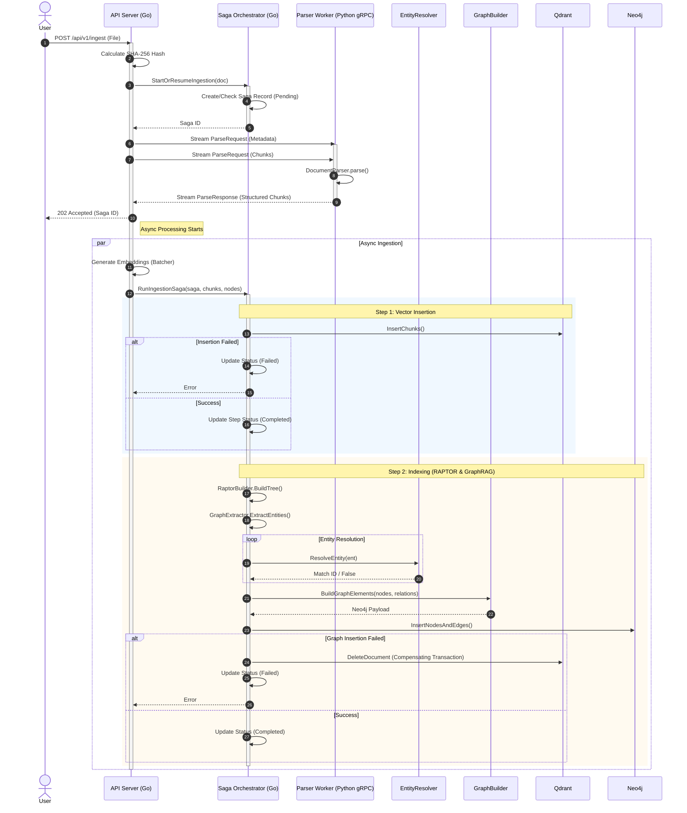

# BookSage Sub-project Architecture

BookSage is a RAG engine designed for high-precision knowledge synthesis from complex, long-context book documents. It operates on a sophisticated hybrid architecture that synergizes the strengths of **LightRAG** (incremental graph updates) and **Lite-BookRAG** (hierarchical structural awareness).

---

## 1. System Overview & Component Roles

The system is architected as a clean decoupling between cognitive orchestration and structural data processing.

### Go API Orchestrator (`api/`)
**Role:** The "Cognitive Conductor" and primary inference engine.
- **REST & SSE Server**: High-concurrency gateway facilitating real-time Agentic reasoning traces via Server-Sent Events.
- **Unified Inference Management**: 
    - **LLM/Embedding Orchestration**: Go directly calls local/cloud LLMs (via Ollama/Gemini) for all cognitive tasks, including embedding generation and entity extraction.
    - **Dual-Model Routing**: Intelligently switches between specialized local embedding models (e.g., `nomic-embed-text`) and reasoning models.
- **SOTA Retrieval & Ranking**:
    - **Dual-level Retrieval**: A LightRAG-inspired methodology that extracts both **Low-level (Entities)** and **High-level (Themes)** keywords in a single pass to drive parallel multi-engine searches across Vector DB (**Qdrant**) and Graph DB (**Neo4j**).
    - **Skyline Ranker**: A BookRAG-based Pareto-optimal ranking engine that merges disparate search results, prioritizing non-dominated chunks based on semantic relevance and structural importance.
- **Reliable Ingestion Saga**: Implements a **Saga Pattern** orchestrated via an internal **SQLite** engine to manage idempotent document processing, hash-derived deduplication, and state recovery.

### Python ML Worker (`worker/`)
**Role:** The "Structural ETL Engine."
- **Layout-Aware Parsing**: Specializes in high-precision layout analysis using **Docling**. It decomposes complex binaries (PDF/EPUB) into structural elements (headings, tables, lists) while preserving logical hierarchies.
- **Intelligent Chunking**: Maps the physical document layout to logical data units, passing hierarchical metadata to Go for **RAPTOR** recursive summarization and tree construction.
- **Offloaded Tensor Operations**: Optionally handles heavy tensor-interaction tasks (e.g., **ColBERTv2** late interaction) to maintain Orchestrator responsiveness.

---

## 2. Core Philosophy & Mechanisms

### A. Strict Separation of Concerns
We enforce the principle that the ML Worker is for **Data Extraction**, while the Go Orchestrator is for **Intelligence**. 
- Heavy model inference is centralized in Go.
- Python is strictly offloaded to CPU/GPU-intensive layout analysis and chunking.

### B. Synergy of BookRAG & LightRAG
1. **Hierarchical Knowledge Graph**: Neo4j stores not just entities, but a **Hierarchical Document Tree**. These are interlinked via **GT-Links** (Graph-Tree Links), allowing the system to traverse from abstract themes to specific mentions seamlessly.
2. **Incremental Graph Updates**: New knowledge is integrated via **Union-based incremental updates** (LightRAG style), allowing for seamless library expansion without the overhead of global re-indexing or community re-computation.
3. **Pareto-Optimal Fusion**: The Skyline Ranker merges vector similarity from **Qdrant** and graph centrality from **Neo4j**, ensuring that retrieved context is both microscopic (exact match) and macroscopic (themed context), strictly pruning noise.

### C. Agentic Evaluation (Self-RAG)
The generation phase is wrapped in an autonomous verification loop:
1. **Context Filtering**: Evaluates retrieved chunks for "relevance" before generation.
2. **Support Level Critique**: Validates if the answer is **Fully Supported**, **Partially Supported**, or has **No Support** in the retrieved context.
3. **Healing Mechanism**: Triggers re-generation or broader retrieval if support is inadequate.

---

## 3. Infrastructure & Tech Stack

- **Databases**:
    - **Qdrant** (Vector Store for Dense/ColBERTv2 embeddings and RAPTOR summaries)
    - **Neo4j** (Graph Store for Entities, Relations, and Hierarchical Trees)
    - **SQLite** (Relational Store for Saga state management and idempotency)
- **Models**: 
    - **Local**: Ollama (Embeddings/Reasoning)
    - **Cloud**: Gemini (Advanced reasoning & Agentic loops)
- **Deployment**: Containerized via Docker / Kubernetes

---

## 4. Class Design

The following diagram illustrates the core components of the BookSage Ingestion Pipeline and Query Engine.

---

## 5. Sequence Diagrams

### 5.1 Ingestion Flow
This flow details the interaction between the Go API Orchestrator (Saga) and the Python Parser Worker, highlighting the refactored strict separation of concerns where business logic (resolution/building) is delegated.

### 5.2 RAG Generation Flow
This flow visualizes the advanced Chain-of-Retrieval (CoR), Fusion Retrieval, and Self-RAG critique loops.

