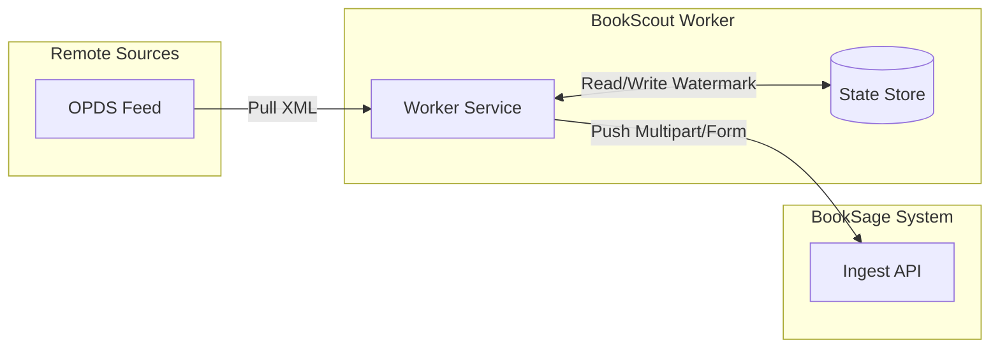
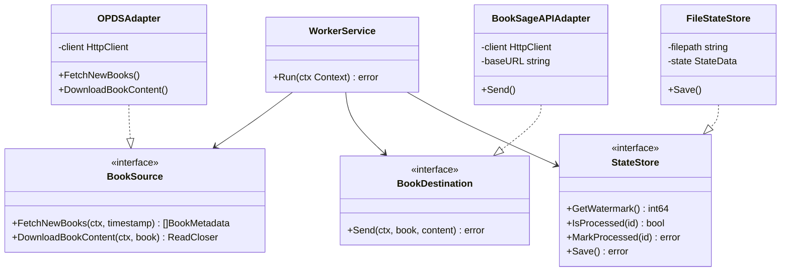
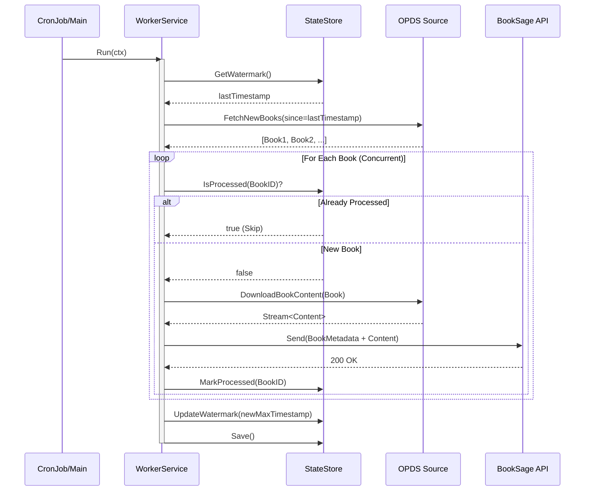

# BookScout Architecture

BookScout is a lightweight, stateful collection worker designed to pull documents from remote sources (like OPDS feeds) and push them to the BookSage ingestion API.

## 1. System Overview (全体設計)

### Responsibilities
- **Extract (Fetch):** Periodically polls remote sources for new content.
- **Filter (State):** Uses a local state store to track processed items and prevent duplicates.
- **Load (Push):** Downloads content and uploads it to the BookSage API (`/api/v1/ingest`).

### Tech Stack
- **Language:** Go 1.25.7
- **Deployment:** Docker / Kubernetes CronJob
- **State:** Local JSON file (persistent volume)

### Boundary
BookScout operates as an external client to BookSage. It does not share databases or internal logic. Communication is strictly via the public REST API.

## 2. Class Design (構造の可視化)

The architecture follows the Hexagonal Architecture (Ports & Adapters) pattern.

## 3. Ingest Sequence (ふるまいの可視化)

The ingestion process is designed to be idempotent and robust against partial failures.

