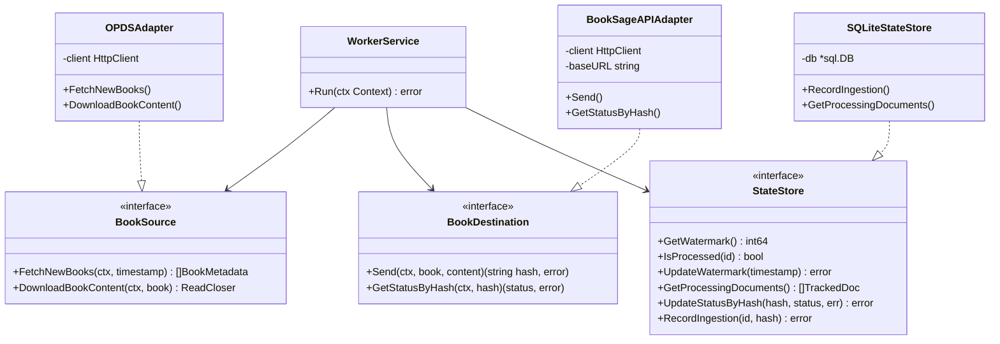
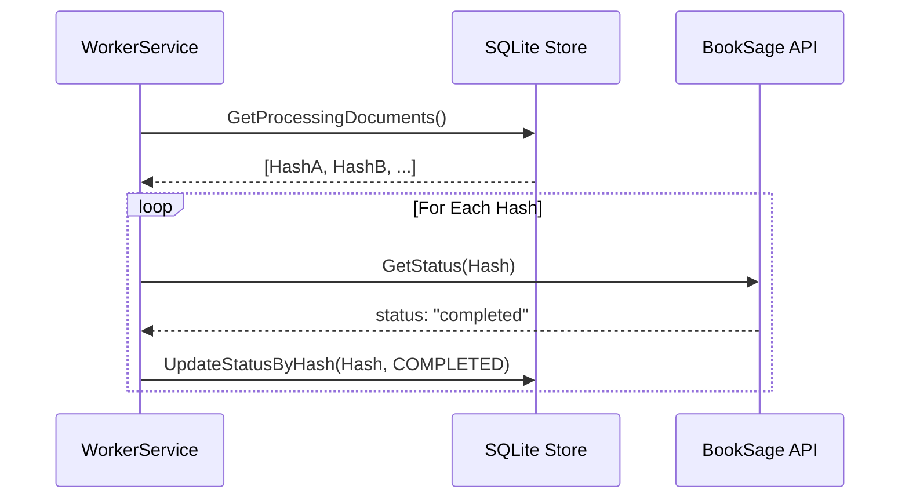
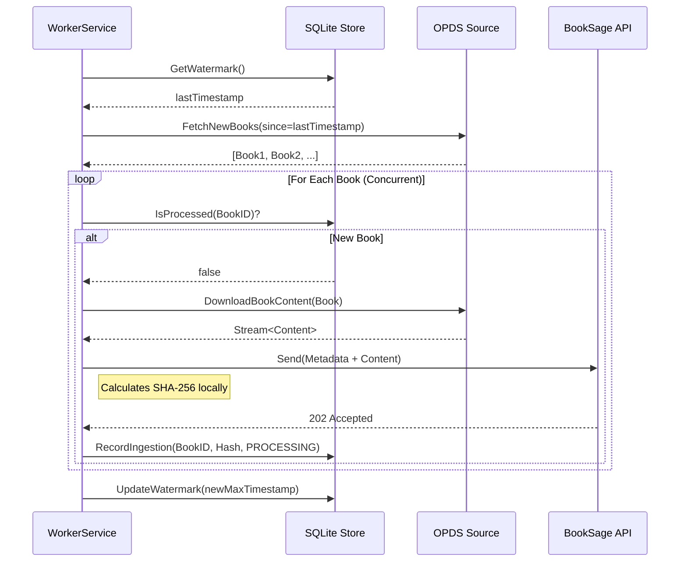

# BookScout Architecture

BookScout is a lightweight, stateful collection worker designed to pull documents from remote sources (like OPDS feeds) and push them to the BookSage ingestion API.

## 1. System Overview (全体設計)

### Responsibilities
- **Extract (Fetch):** Periodically polls remote sources for new content.
- **Filter (State):** Uses a local SQLite state store to track processed items and prevent duplicates.
- **Load (Push):** Downloads content, calculates SHA-256 hash, and uploads it to the BookSage API (`/api/v1/ingest`).
- **Sync (Status):** Polls BookSage API for the status of asynchronous ingestion tasks.

### Tech Stack
- **Language:** Go 1.25.7
- **Deployment:** Docker / Kubernetes CronJob
- **State:** SQLite 3 (managed by Bun ORM)
- **Config:** Viper (Environment variables & Defaults)
- **CLI:** Cobra

### Boundary
BookScout operates as an external client to BookSage. It does not share databases or internal logic. Communication is strictly via the public REST API.

```mermaid
graph LR
    subgraph External["Remote Sources"]
        OPDS[OPDS Feed]
    end

    subgraph BookScout["BookScout Worker"]
        Worker[Worker Service]
        State[(SQLite Store)]
    end

    subgraph BookSage["BookSage System"]
        API[Ingest API]
    end

    OPDS -->|Pull XML| Worker
    Worker <-->|Read/Write Watermark & Status| State
    Worker -->|Push Multipart + SHA256| API
    Worker <--|Poll Status by Hash| API
```

## 2. Class Design (構造の可視化)

The architecture follows the Hexagonal Architecture (Ports & Adapters) pattern.

```mermaid
classDiagram
    direction TB

    class WorkerService {
        +Run(ctx Context) error
    }

    class BookSource {
        <<interface>>
        +FetchNewBooks(ctx, timestamp) []BookMetadata
        +DownloadBookContent(ctx, book) ReadCloser
    }

    class BookDestination {
        <<interface>>
        +Send(ctx, book, content) (string hash, error)
        +GetStatusByHash(ctx, hash) (status, error)
    }

    class StateStore {
        <<interface>>
        +GetWatermark() int64
        +IsProcessed(id) bool
        +UpdateWatermark(timestamp) error
        +GetProcessingDocuments() []TrackedDoc
        +UpdateStatusByHash(hash, status, err) error
        +RecordIngestion(id, hash) error
    }

    class OPDSAdapter {
        -client HttpClient
        +FetchNewBooks()
        +DownloadBookContent()
    }

    class BookSageAPIAdapter {
        -client HttpClient
        -baseURL string
        +Send()
        +GetStatusByHash()
    }

    class SQLiteStateStore {
        -db *sql.DB
        +RecordIngestion()
        +GetProcessingDocuments()
    }

    WorkerService --> BookSource
    WorkerService --> BookDestination
    WorkerService --> StateStore

    OPDSAdapter ..|> BookSource
    BookSageAPIAdapter ..|> BookDestination
    SQLiteStateStore ..|> StateStore
```

## 3. Ingest Sequence (ふるまいの可視化)

The ingestion process is split into two phases to handle asynchronous API processing reliably.

### Phase 1: Status Sync

```mermaid
sequenceDiagram
    participant W as WorkerService
    participant S as SQLite Store
    participant B as BookSage API

    W->>S: GetProcessingDocuments()
    S-->>W: [HashA, HashB, ...]
    loop For Each Hash
        W->>B: GetStatus(Hash)
        B-->>W: status: "completed"
        W->>S: UpdateStatusByHash(Hash, COMPLETED)
    end
```

### Phase 2: Scrape & Ingest

```mermaid
sequenceDiagram
    participant W as WorkerService
    participant S as SQLite Store
    participant O as OPDS Source
    participant B as BookSage API

    W->>S: GetWatermark()
    S-->>W: lastTimestamp

    W->>O: FetchNewBooks(since=lastTimestamp)
    O-->>W: [Book1, Book2, ...]

    loop For Each Book (Concurrent)
        W->>S: IsProcessed(BookID)?
        alt New Book
            S-->>W: false
            W->>O: DownloadBookContent(Book)
            O-->>W: Stream<Content>
            W->>B: Send(Metadata + Content)
            Note right of W: Calculates SHA-256 locally
            B-->>W: 202 Accepted
            W->>S: RecordIngestion(BookID, Hash, PROCESSING)
        end
    end

    W->>S: UpdateWatermark(newMaxTimestamp)
```
