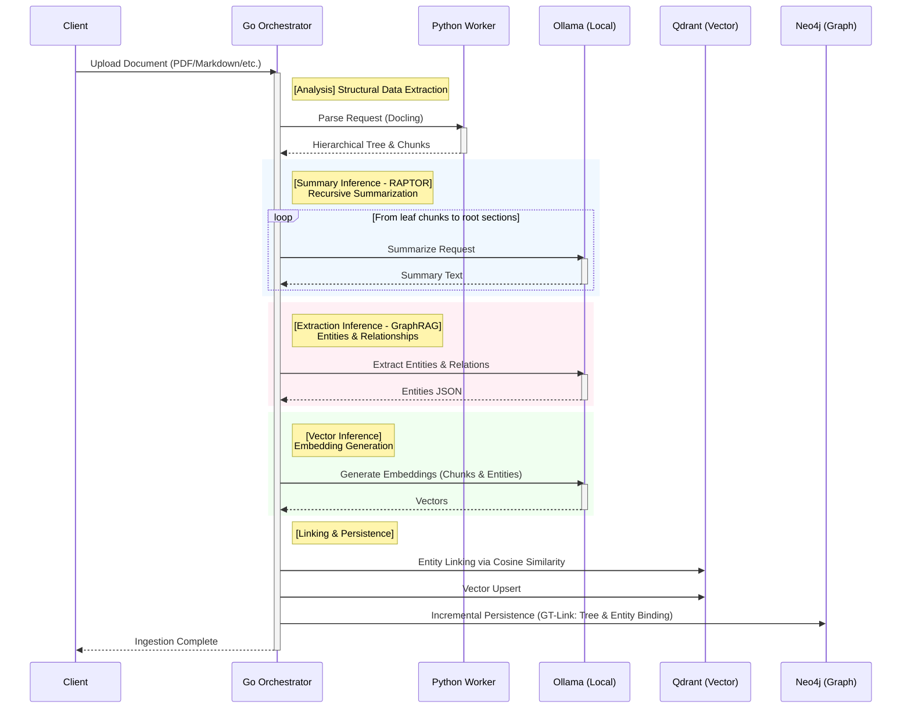
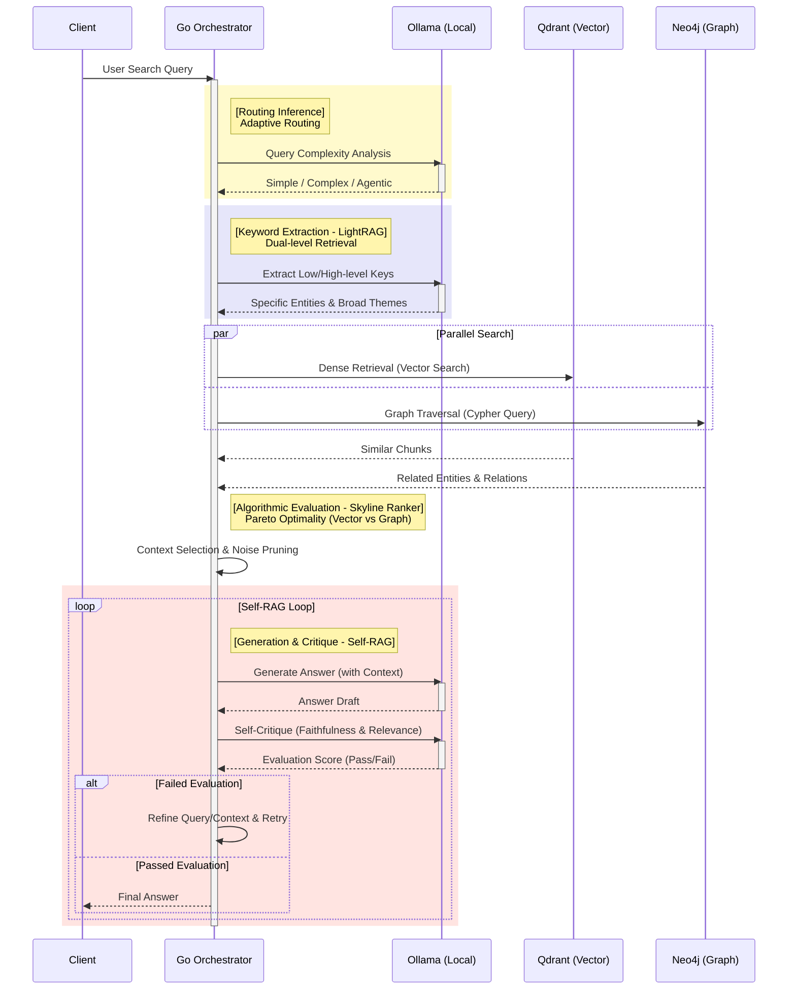

# BookSage Inference Algorithm Visualization

This document explains the inference algorithm flow in "BookSage," an Agentic RAG system.
The system is architected around the **Go API Orchestrator**. All LLM inference (generation, embedding) is managed by the Go service. The Python Worker is specialized purely for structural document analysis (ETL) and does not perform inference.

## 1. Ingestion Pipeline Algorithms

This flow covers the process from document upload to storage in the Vector Store (Qdrant) and Graph Database (Neo4j).
It builds a multi-dimensional index by combining hierarchical summary generation (RAPTOR) and entity extraction (GraphRAG).

### Algorithm Details

1.  **[Analysis] Structural Parsing via Python Worker**
    -   The Go Orchestrator sends document data to the Python Worker.
    -   The Python Worker uses specialized libraries like `Docling` to parse the document, extracting the chapter/section hierarchy (Tree) and micro-text chunks.
    -   *Constraint*: The Python Worker does not invoke LLMs.

2.  **[Summary Inference - RAPTOR] Recursive Summarization**
    -   The Go Orchestrator receives extracted chunks and invokes Ollama.
    -   Based on the **RAPTOR (Recursive Abstractive Processing for Tree-Organized Retrieval)** algorithm, it summarizes groups of child chunks to generate parent nodes (Section Summaries). This is repeated recursively up to the root, capturing global context.

3.  **[Extraction Inference - GraphRAG] Entity & Relationship Extraction**
    -   The Go Orchestrator invokes Ollama for each chunk to extract critical "Entities" (People, Places, Concepts) and their "Relationships."
    -   This constructs a knowledge graph representing semantic connections that traditional keyword search might miss.

4.  **[Vector Inference] Embedding Generation**
    -   The Go Orchestrator calls Ollama (Embedding models) to generate vector representations for text chunks, summaries, and extracted entities.

5.  **[Linking & Persistence] Qdrant & Neo4j Storage**
    -   **Qdrant**: Stores vectors. It uses cosine similarity to perform entity linking (deduplication) before upserting.
    -   **Neo4j**: Stores the document hierarchy (Tree nodes) and extracted entities. The **GT-Link (Graph-Tree Link)** algorithm interlinks the structural tree and the semantic graph, enabling cross-modal retrieval.

---

## 2. Query & Generation Pipeline Algorithms

This flow covers the process from receiving a user query to generating an optimal response.
It features adaptive routing, multi-engine retrieval, and a self-evaluation loop.

### Algorithm Details

1.  **[Routing Inference] Adaptive Routing**
    -   Upon receiving a query, the Go Orchestrator invokes Ollama to analyze its nature.
    -   It classifies the query as a simple fact-check, a complex multi-part reasoning task, or an "Agentic" task requiring multiple steps, dynamically switching the downstream pipeline.

2.  **[Keyword Extraction - LightRAG] Dual-level Retrieval**
    -   The Go Orchestrator calls Ollama to extract search keys.
    -   Following the **LightRAG** philosophy, it extracts "Low-level keys" (specific entity names) and "High-level keys" (abstract themes/concepts) simultaneously to capture both microscopic details and macroscopic context.

3.  **[Parallel Search] Vector & Graph Parallel Search**
    -   Using Go's `Goroutines`, the system performs parallel searches across Qdrant (dense vector search) and Neo4j (graph traversal).
    -   This ensures context is gathered from both semantic similarity and structural relationship vantage points.

4.  **[Algorithmic Evaluation] Skyline Ranker**
    -   The system filters the vast amount of candidate context using internal logic.
    -   The **Skyline Ranker** algorithm evaluates candidates across two axes: "Vector Similarity Score" and "Graph Centrality Score." It selects the **Pareto-optimal** set (where no candidate is strictly outperformed by another in both dimensions), strictly pruning noise to optimize the LLM's context window.

5.  **[Generation & Critique] Self-RAG Self-Correction Loop**
    -   The selected context is sent to Ollama to generate a response.
    -   The generated answer is immediately critiqued using Ollama for **Faithfulness** (is it grounded?) and **Relevance** (does it answer the query?).
    -   If the criteria are not met, the Go Orchestrator refined the search query or re-selects context and retries the generation loop.
