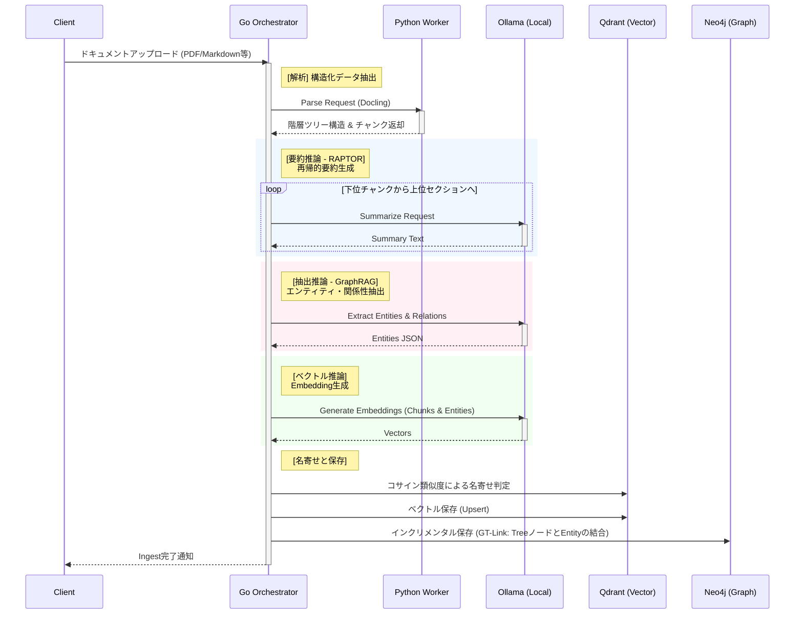
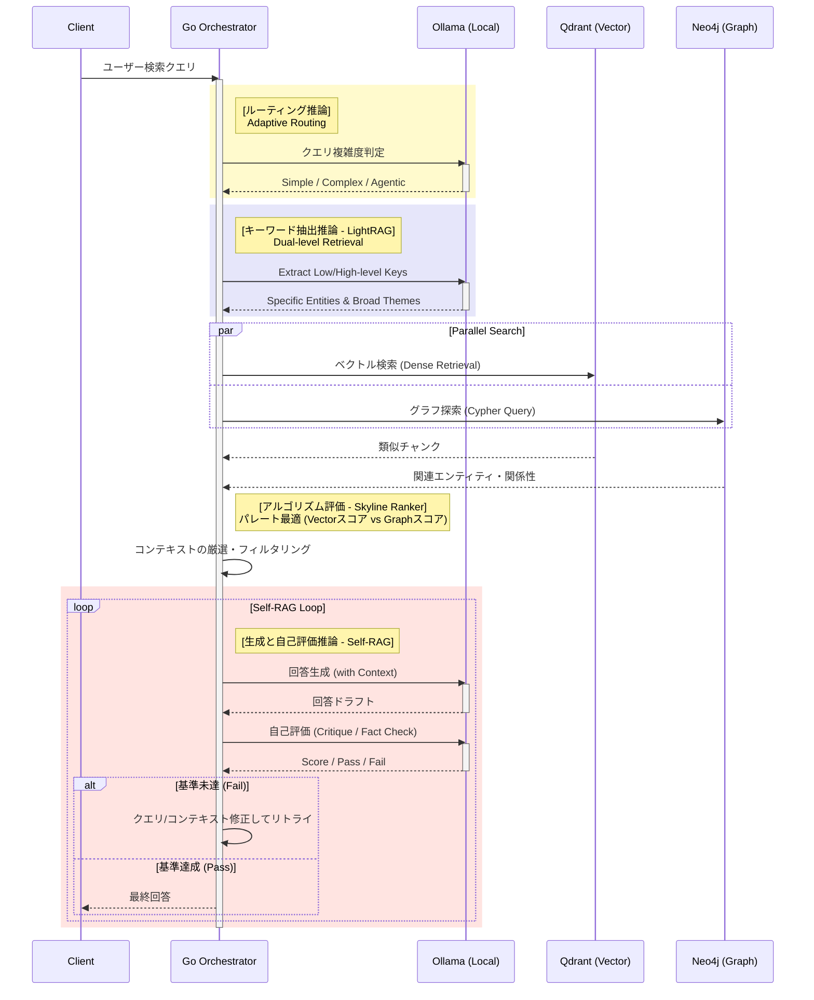

# BookSage 推論アルゴリズム視覚化ドキュメント

本ドキュメントでは、Agentic RAGシステム「BookSage」における推論アルゴリズムのフローを解説します。
システムは **Go API Orchestrator** を中心とした設計となっており、全てのLLM推論（生成、Embedding）はGoサービスが管理します。Python Workerはドキュメントの構造解析のみを担当し、推論処理は行いません。

## 1. Ingest（取り込み）時の推論アルゴリズム

ドキュメントのアップロードから、ベクトルストア（Qdrant）およびグラフデータベース（Neo4j）への保存までのフローです。
階層的な要約生成（RAPTOR）とエンティティ抽出（GraphRAG）を組み合わせ、多角的なインデックスを構築します。

### アルゴリズム詳細

1.  **[解析] Python WorkerによるDoclingパース**
    -   Go OrchestratorからPython Workerへドキュメントデータを送信します。
    -   Python Workerは `Docling` 等のライブラリを用いてドキュメントを解析し、章・節・項の階層構造（Tree）と、最小単位のテキストチャンクを抽出してGoへ返却します。
    -   *制約事項*: Python WorkerはLLMを一切呼び出しません。

2.  **[要約推論 - RAPTOR] 再帰的要約**
    -   Go Orchestratorは抽出されたチャンクを受け取り、Ollamaを呼び出します。
    -   **RAPTOR (Recursive Abstractive Processing for Tree-Organized Retrieval)** アルゴリズムに基づき、下位のチャンク群を要約して上位のノード（セクション要約）を生成します。これをルートノードまで再帰的に繰り返すことで、ドキュメントの全体像を捉えたコンテキストを生成します。

3.  **[抽出推論 - GraphRAG] エンティティと関係性の抽出**
    -   Go Orchestratorは各チャンクに対してOllamaを呼び出し、テキスト内に含まれる重要な「エンティティ（人物、場所、概念など）」と、それらの間の「関係性」を抽出します。
    -   これにより、キーワード検索だけでは捉えきれない意味的なつながりをグラフデータとして構築します。

4.  **[ベクトル推論] Embedding生成**
    -   抽出されたテキストチャンク、生成された要約、および抽出されたエンティティに対して、Go OrchestratorがOllama（Embeddingモデル）を呼び出し、ベクトル表現を生成します。

5.  **[名寄せと保存] Qdrant & Neo4jへの保存**
    -   **Qdrant**: 生成されたベクトルを用い、既存データとのコサイン類似度を計算して名寄せ（重複排除）を行った上で保存します。
    -   **Neo4j**: ドキュメントの階層構造（Treeノード）と抽出されたエンティティを保存します。この際、**GT-Link (Graph-Tree Link)** アルゴリズムにより、構造ツリーと意味グラフを相互に結合し、横断的な検索を可能にします。

---

## 2. Inference（検索・生成）時の推論アルゴリズム

ユーザーからのクエリを受け取り、最適な回答を生成するまでのフローです。
適応的なルーティング、多角的な検索、および自己評価ループを備えています。

### アルゴリズム詳細

1.  **[ルーティング推論] Adaptive Routing**
    -   Go Orchestratorはユーザーのクエリを受け取ると、まずOllamaを呼び出してクエリの性質を分析します。
    -   クエリが単純な事実確認か、複雑な推論を要するか、あるいはマルチステップの処理が必要か（Agentic）を判定し、後続の処理パイプラインを動的に切り替えます。

2.  **[キーワード抽出推論 - LightRAG] Dual-level Retrieval**
    -   Go OrchestratorはOllamaを呼び出し、クエリから検索用のキーワードを抽出します。
    -   **LightRAG** のアプローチを採用し、「Low-level keys（具体的なエンティティ名など）」と「High-level keys（抽象的なテーマや概念）」を同時に抽出することで、局所的な情報と大局的な文脈の両方を検索対象とします。

3.  **[並行探索] Vector & Graph Parallel Search**
    -   抽出されたキーワードを用い、Goの `Goroutines` を使用してQdrant（ベクトル検索）とNeo4j（グラフ探索）を並行して検索します。
    -   これにより、意味的な類似性と構造的な関連性の両面から候補となるコンテキストを収集します。

4.  **[アルゴリズム評価] Skyline Ranker**
    -   収集された膨大なコンテキスト候補に対し、Go内部のロジックでフィルタリングを行います。
    -   **Skyline Ranker** アルゴリズムを適用し、「ベクトル類似度スコア」と「グラフ関連度スコア」の2軸で評価します。パレート最適（どちらのスコアも他の候補より劣っていない解）なコンテキストのみを厳選し、LLMのコンテキストウィンドウを効率的に利用します。

5.  **[生成と自己評価推論 - Self-RAG] Generation & Critique**
    -   厳選されたコンテキストと共にOllamaへプロンプトを送信し、回答を生成します。
    -   生成された回答に対し、即座にOllamaを用いて「自己評価（Critique）」を行います。回答が事実に基づいているか（Faithfulness）、クエリに答えているか（Relevance）を検証します。
    -   基準を満たさない場合、Go Orchestratorは検索クエリを修正したりコンテキストを再選定したりして、回答生成をリトライします（Self-Correction Loop）。
