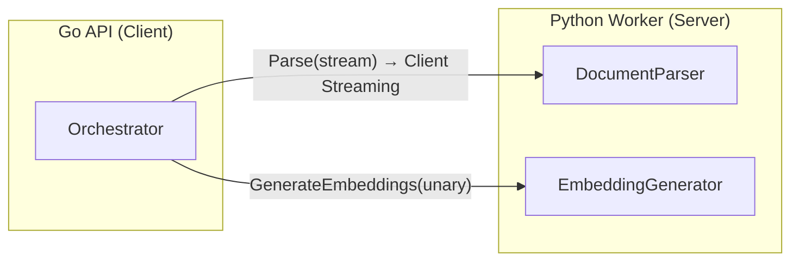

# BookSage Development Roadmap & Technical Sync

---

## 1. Development Phases & Roadmap

### Current Assessment (As-Is)

Based on a thorough review of the actual codebase, the following **Implemented / Mock** statuses have been confirmed.

| Layer | Implemented ✅ | Mock/Stub 🟡 |
|---|---|---|
| Infra & CI | Docker Compose, CI (lint/test), Makefile | — |
| gRPC Communication | Proto Definitions, Client Streaming (Parse), Unary (Embedding) | — |
| Go API | Server (REST+SSE +Middleware), Config, Embedding Batcher, LLM Router, Ingest Saga, Fusion Retriever (Dense+Graph), Agent/Generator (CoR+Self-RAG), Circuit Breaker, Graceful Shutdown | RAPTOR Engine, ColBERT Engine |
| Go DB Client | Qdrant Client (Search+Insert+Delete+PayloadIndex), Neo4j Client (Insert+Search+Delete) | — |
| Python Worker | gRPC Servicer, DocumentParser (Docling/PyMuPDF), EmbeddingGenerator | SelfRAGCritique, ColBERT, RAPTOR |
| DB Schema | Qdrant Collection (dense), Neo4j (Document→Chunk graph) | ColBERT/RAPTOR Collections |

---

### Phase 1: End-to-End Ingest MVP (Foundational)

> **Goal**: Ingest a single document and verify that data is correctly stored in Qdrant/Neo4j.

| Task | Component | Status |
|---|---|---|
| Worker: Split Docling parse results into Chunks → gRPC Response | Python | ✅ |
| Go: Correctly construct Chunks/Nodes from gRPC Parse response | Go | ✅ |
| Go: Real Qdrant Client vector insertion (deterministic ID + PayloadIndex) | Go | ✅ |
| Go: Real Neo4j Client node/edge insertion (Document→Chunk graph) | Go | ✅ |
| E2E Test: Automated test for PDF ingest → DB verification | Both | 🟡 |

**Completion Criteria**: `make up-build` → Upload PDF → Data verified in Qdrant/Neo4j.

---

### Phase 2: Single-Engine Retrieval + Basic Q&A

> **Goal**: Answer questions using a single vector search engine.

| Task | Component | Status |
|---|---|---|
| Go Fusion: Connect Qdrant Dense Search | Go | ✅ |
| Worker: Query Embedding generation | Python | ✅ |
| Go Agent: Pass Context + Query to LLM for answer generation (RAG Prompt) | Go | ✅ |
| Server: Return real-time answers via SSE Streaming | Go | ✅ |
| Neo4j Cypher Query implementation (Graph Search / CONTAINS) | Go | ✅ |

**Completion Criteria**: Query `/api/v1/query` → Qdrant search → LLM generation → SSE response.

---

### Phase 3: Multi-Engine Fusion + Self-RAG

> **Goal**: 3-engine parallel search + Intent Fusion + Self-RAG evaluation loop.

| Task | Component | Status |
|---|---|---|
| Go Fusion: Parallel connection of 3 engines (Graph/RAPTOR/ColBERT) | Go | ✅ |
| Python: ColBERT Late Interaction implementation | Python | ✅ |
| Python: RAPTOR Tree construction + Search | Python | ✅ |
| Go Agent: Self-RAG (Retrieval Critique → Generation Critique) | Go | ✅ |
| Go Agent: Dual-level Retrieval (Specific & Abstract Extraction) | Go | ✅ |
| Intent-Driven Dynamic Fusion (Operator Pattern + Skyline Ranker) | Go | ✅ |

**Completion Criteria**: Complex query → Intent classification → Weighted Fusion → Self-evaluation → High-quality answer.

---

### Phase 4: Production Readiness & Scaling

> **Goal**: Observability, fault tolerance, and performance optimization.

| Task | Component | Status |
|---|---|---|
| Request ID Middleware + Structured Logging + Recovery | Go | ✅ |
| Circuit Breaker (Closed/Open/HalfOpen) | Go | ✅ |
| Health/Readiness Probes (/healthz, /readyz) | Go | ✅ |
| Graceful Shutdown (SIGTERM/SIGINT) | Go | ✅ |
| OpenTelemetry Tracing (correlation_id propagation) | Both | 🟡 |
| GPU Memory Management & Model Warm-up | Python | 🟡 |
| Kubernetes Manifests (HPA, Resource Limits) | Infra | 🟡 |
| BookScout OPDS Scraper → Ingest API Integration | Go | 🟡 |

---

## 2. gRPC Interface Design

### Current Proto Definition (Implemented)



| RPC | Direction | Streaming | Purpose |
|---|---|---|---|
| `Parse(stream ParseRequest) → ParseResponse` | Go→Python | **Client Streaming** | PDF/EPUB binary transfer (Bypass 4MB limit) |
| `GenerateEmbeddings(EmbeddingRequest) → EmbeddingResponse` | Go→Python | Unary | Text-to-Vector conversion |

### Proposed RPC Enhancements

| Candidate RPC | Streaming | Rationale |
|---|---|---|
| `AgenticGenerate(QueryRequest) → stream AgenticEvent` | **Server Streaming** | Reduce TTFT for SSE responses. Stream reasoning traces, sources, and answer chunks. |
| `RetrieveFromWorker(RetrievalRequest) → RetrievalResponse` | Unary | If ColBERT Late Interaction is executed on the Worker side. |
| `HealthCheck(Empty) → HealthResponse` | Unary | Worker liveness / readiness probe. |

> [!IMPORTANT]
> **Server Streaming for Agentic**: When implementing Phase 2's `/api/v1/query` SSE, a **two-tier** approach is required: Go→Frontend via HTTP SSE, and Go→Python via gRPC Server Streaming.

---

## 3. Core Data Pipeline Flows

### 3.1 Ingestion Pipeline

```mermaid
sequenceDiagram
    participant User as User/BookScout
    participant API as Go API
    participant Worker as Python Worker
    participant Qdrant
    participant Neo4j
    participant SQLite

    User->>API: POST /api/v1/ingest (multipart)
    API->>API: SHA256 Calculation → Duplicate Check
    API->>SQLite: CreateDocument + CreateSaga(Pending)

    rect rgb(40, 40, 80)
    Note over API,Worker: gRPC Client Streaming
    API->>Worker: ParseRequest{metadata} (1st msg)
    API->>Worker: ParseRequest{chunk_data} (2nd~N msg)
    Worker->>Worker: ETL via Docling/PyMuPDF
    Worker->>Worker: Layout-aware Chunking
    Worker-->>API: ParseResponse{documents[], metadata}
    end

    rect rgb(40, 80, 40)
    Note over API,Worker: gRPC Unary (Batched)
    API->>Worker: EmbeddingRequest{texts[], "dense"}
    Worker->>Worker: sentence-transformers encode
    Worker-->>API: EmbeddingResponse{DenseVector[]}
    end

    API->>API: Saga Step: Embedding
    API->>Qdrant: Upsert(points with doc_id filter)

    API->>API: Saga Step: Indexing
    API->>Neo4j: MERGE(Chunk nodes with doc_id)

    API->>SQLite: UpdateSagaStatus(Completed)
    API-->>User: 202 {document_id, status: processing}
```



**Compensation Logic (Implemented)**: If Neo4j insertion fails → Qdrant DeleteDocument → Saga Failed.

---

### 3.2 Retrieval & Generation Pipeline (Target State)

```mermaid
sequenceDiagram
    participant User
    participant API as Go API
    participant LLM as LLM Router
    participant Qdrant
    participant Neo4j
    participant Gemini

    User->>API: POST /api/v1/query {query}

    rect rgb(60, 40, 40)
    Note over API: Dual-level Retrieval
    API->>LLM: RouteLLMTask("keyword_extraction")
    LLM-->>API: Sub-queries / Keywords
    end

    rect rgb(40, 40, 80)
    Note over API,Neo4j: Parallel Fusion Retrieval (errgroup)
    par Graph Engine
        API->>Neo4j: Cypher Query (entity relationships)
    and RAPTOR Engine
        API->>Qdrant: Search(raptor_collection, summary vectors)
    and ColBERT Engine
        API->>Qdrant: Search(colbert_collection, token vectors)
    end
    Neo4j-->>API: Graph results
    Qdrant-->>API: RAPTOR results
    Qdrant-->>API: ColBERT results
    end

    API->>API: Intent Classification → Skyline Ranker (Pareto)

    rect rgb(40, 60, 40)
    Note over API: Self-RAG Loop
    API->>LLM: "Is context relevant?" (Retrieval Critique)
    LLM-->>API: [Relevant] / [Irrelevant]
    API->>Gemini: Generate answer with context
    Gemini-->>API: Answer
    API->>LLM: "Is answer factually supported?" (Generation Critique)
    LLM-->>API: [Fully Supported] / [No Support]
    end

    API-->>User: SSE stream {reasoning, sources, answer}
```



---

## 4. Database & Index Responsibilities

### Qdrant (Vector DB)

| Collection | Purpose | Vector Type | Payload |
|---|---|---|---|
| `booksage_dense` | Dense Semantic Search | `Float32[768]` | `doc_id`, `chunk_id`, `text`, `page_number` |
| `booksage_colbert` | ColBERT Late Interaction | `MultiVector[seq_len × 128]` | `doc_id`, `chunk_id`, `text` |
| `booksage_raptor` | RAPTOR Summary Tree | `Float32[768]` | `doc_id`, `level` (leaf/branch/root), `summary_text` |

**Filtering Strategy**: `doc_id` is set as a Payload Index across all collections. All searches use a `must` filter to scope requests to specific documents when necessary.

### Neo4j (Graph DB)

```
(:Document {doc_id, title, author})
    -[:HAS_CHAPTER]->
(:Chapter {chapter_number, title, doc_id})
    -[:HAS_CHUNK]->
(:Chunk {chunk_id, text, page_number, doc_id})

(:Entity {name, type})
    -[:MENTIONED_IN]->
(:Chunk)

(:Chunk)-[:NEXT_CHUNK]->(:Chunk)
```

| Node | Responsibility | Major Properties |
|---|---|---|
| Document | Book Metadata | `doc_id`, `title`, `author` |
| Chapter | TOC Structure (Two-Level Index) | `chapter_number`, `title` |
| Chunk | Text Fragment | `chunk_id`, `text`, `page_number` |
| Entity | NER Extracted Entities | `name`, `type` |

**Linking**: The `chunk_id` serves as the common key to join Qdrant payloads with Neo4j Chunk nodes.

---

## 5. Potential Technical Risks & Mitigations

| # | Risk | Impact | Mitigation |
|---|---|---|---|
| 1 | **gRPC Memory Spikes on Large PDFs** | Worker OOM Kill | Client Streaming chunk size restricted to `256KB` に制限。Worker側で `tempfile` に書き出してからパース (✅ implemented) |
| 2 | **gRPC Timeouts** (Docling ETL can take minutes) | Parse RPC Failure | Sufficiently large `ParserTimeout` (currently 60s). Consider Bi-directional Streaming for progress updates in Phase 4. |
| 3 | **Embedding Batch Exceeding 4MB** | gRPC Resource Exhausted | Batcher (✅ implemented, batch=100) splits messages into safe sizes. |
| 4 | **GPU CUDA Context Corruption** | Worker Freeze/Crash | `ProcessPoolExecutor` used for CPU tasks, `ThreadPoolExecutor` for GPU (✅ Designed). |
| 5 | **Qdrant/Neo4j Data Inconsistency** | Mismatched Index States | Saga Compensation Pattern (✅ implemented): Qdrant Rollback on Neo4j failure. |
| 6 | **Fusion Retrieval Latency** | Blocked by slowest engine | `errgroup` + `context.WithTimeout(3s)` + Fail-soft (✅ Designed): Graceful degradation if one engine fails. |
| 7 | **ColBERT Storage Explosion** | Resource Exhaustion | Enabled Qdrant `Quantization` (Binary/Scalar). Use RAPTOR for summary compression of long documents. |
| 8 | **Cost Overruns on Cloud LLM** | Excessive Gemini Billing | `UseLocalOnlyLLM` flag (✅ implemented): Use Ollama by default except for complex tasks. |
