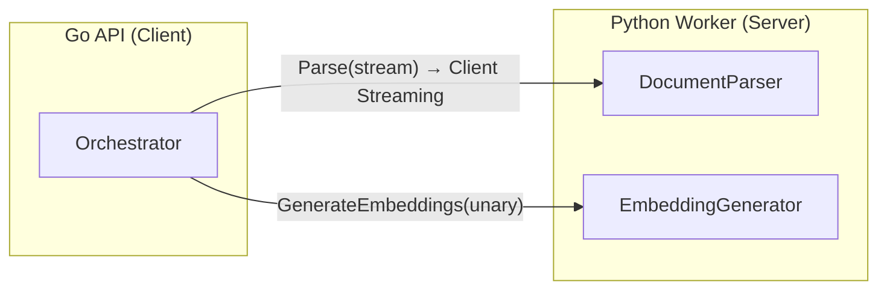

# BookSage 開発ロードマップ & 技術設計整理

---

## 1. 開発フェーズとロードマップ

### 現状アセスメント（As-Is）

実コードを精査した結果、以下の **実装済み / Mock** 状態を確認した。

| レイヤー | 実装済み ✅ | Mock/Stub 🟡 |
|---|---|---|
| Infra & CI | Docker Compose, CI (lint/test), Makefile | — |
| gRPC通信 | Proto定義, Client Streaming (Parse), Unary (Embedding) | — |
| Go API | Server (REST), Config, Embedding Batcher, LLM Router, Ingest Saga | Fusion Retriever (3エンジン全てモック), Agent/Generator |
| Go DB Client | Qdrant Client (real SDK), Neo4j Client (real SDK) | Fusion内の検索ロジック |
| Python Worker | gRPC Servicer, DocumentParser (Docling/PyMuPDF), EmbeddingGenerator | SelfRAGCritique, Agent, Retrieval Adapters |
| DB Schema | — | Qdrant Collection / Neo4j Node設計 |

---

### Phase 1: End-to-End Ingest MVP （基盤確立）

> **目標**: ドキュメント1冊を投入し、Qdrant/Neo4jに正しくデータが格納される。

| タスク | コンポーネント |
|---|---|
| Worker: Doclingパース結果をChunkに分割 → gRPC Response | Python |
| Go: gRPC Parse応答からChunk/Nodeを正しく構築 | Go |
| Go: Real Qdrant Client でベクトル挿入 | Go |
| Go: Real Neo4j Client でノード/エッジ挿入 | Go |
| E2E Test: PDF投入→DB確認の自動テスト | Both |

**完了基準**: `make up-build` → PDF アップロード → Qdrant/Neo4j にデータが格納される。

---

### Phase 2: Single-Engine Retrieval + 基本Q&A

> **目標**: 1つのベクトルDBエンジンで質問に回答できる。

| タスク | コンポーネント |
|---|---|
| Go Fusion: Qdrant Dense Search を実接続 | Go |
| Worker: Query用 Embedding 生成 | Python |
| Go Agent: LLM に Context + Query を渡して回答生成 | Go |
| Server: SSE Streaming でリアルタイム回答返却 | Go |
| Neo4j Cypher Query 実装 (Graph Search) | Go |

**完了基準**: `/api/v1/query` に質問 → Qdrant検索 → LLM生成 → SSE回答。

---

### Phase 3: Multi-Engine Fusion + Self-RAG

> **目標**: 3エンジン並列検索 + Intent Fusion + Self-RAG評価ループ。

| タスク | コンポーネント |
|---|---|
| Go Fusion: 3エンジン(Graph/RAPTOR/ColBERT)の実接続 | Go |
| Python: ColBERT Late Interaction 実装 | Python |
| Python: RAPTOR Tree 構築 + 検索 | Python |
| Go Agent: Self-RAG (Retrieval Critique → Generation Critique) | Go |
| Go Agent: Chain-of-Retrieval (CoR) サブクエリ分解 | Go |
| Intent-Driven Dynamic Fusion (Operator Pattern) | Go/Python |

**完了基準**: 複合質問 → 意図分類 → 重み付きFusion → 自己評価 → 高品質回答。

---

### Phase 4: 本番対応 + スケーリング

> **目標**: 可観測性、耐障害性、パフォーマンス最適化。

| タスク | コンポーネント |
|---|---|
| OpenTelemetry トレーシング (correlation_id 伝搬) | Both |
| Rate Limiting / Circuit Breaker | Go |
| GPU メモリ管理 & モデル Warm-up | Python |
| Kubernetes マニフェスト (HPA, Resource Limits) | Infra |
| BookScout OPDS Scraper → Ingest API 連携 | Go |

---

## 2. gRPC インターフェース設計の整理

### 現行Proto定義 (実装済み)



| RPC | 方向 | ストリーミング | 用途 |
|---|---|---|---|
| `Parse(stream ParseRequest) → ParseResponse` | Go→Python | **Client Streaming** | PDF/EPUBバイナリ転送 (4MB制限回避) |
| `GenerateEmbeddings(EmbeddingRequest) → EmbeddingResponse` | Go→Python | Unary | テキスト→ベクトル変換 |

### 追加検討が必要なRPC

| 候補RPC | ストリーミング | 根拠 |
|---|---|---|
| `AgenticGenerate(QueryRequest) → stream AgenticEvent` | **Server Streaming** | SSE応答のTTFT短縮。推論トレース・ソース・回答をチャンク送信 |
| `RetrieveFromWorker(RetrievalRequest) → RetrievalResponse` | Unary | Worker側でColBERT Late Interactionを実行する場合 |
| `HealthCheck(Empty) → HealthResponse` | Unary | Worker liveness / readiness probe |

> [!IMPORTANT]
> **Server Streaming for Agentic**: Phase 2で`/api/v1/query`のSSE実装時に、Go→Frontend は HTTP SSE、Go→Python は gRPC Server Streaming の**二段構え**が必要。

---

## 3. 主要データパイプラインのフロー整理

### 3.1 インジェストパイプライン


**補償ロジック (実装済み)**: Neo4j挿入失敗時 → Qdrant DeleteDocument → Saga Failed。

---

### 3.2 検索・生成パイプライン（目標状態）


---

## 4. データベースとインデックスの責務分界

### Qdrant (ベクトルDB)

| Collection | 用途 | ベクトル型 | Payload |
|---|---|---|---|
| `booksage_dense` | Dense Semantic Search | `Float32[768]` | `doc_id`, `chunk_id`, `text`, `page_number` |
| `booksage_colbert` | ColBERT Late Interaction | `MultiVector[seq_len × 128]` | `doc_id`, `chunk_id`, `text` |
| `booksage_raptor` | RAPTOR Summary Tree | `Float32[768]` | `doc_id`, `level` (leaf/branch/root), `summary_text` |

**フィルタリング戦略**: 全Collectionで `doc_id` をPayload Indexに設定。検索時に `must` フィルタで特定ドキュメントにスコープ可能。

### Neo4j (グラフDB)

```
(:Document {doc_id, title, author})
    -[:HAS_CHAPTER]->
(:Chapter {chapter_number, title, doc_id})
    -[:HAS_CHUNK]->
(:Chunk {chunk_id, text, page_number, doc_id})

(:Entity {name, type})
    -[:MENTIONED_IN]->
(:Chunk)

(:Chunk)-[:NEXT_CHUNK]->(:Chunk)
```

| ノード | 責務 | 主要プロパティ |
|---|---|---|
| Document | 書籍メタデータ | `doc_id`, `title`, `author` |
| Chapter | 目次構造 (Two-Level Index) | `chapter_number`, `title` |
| Chunk | テキスト断片 | `chunk_id`, `text`, `page_number` |
| Entity | NER抽出エンティティ | `name`, `type` |

**紐付け**: `chunk_id` を共通キーとしてQdrantのPayloadとNeo4jのChunkノードを結合。

---

## 5. 潜在的な技術的リスクと対策

| # | リスク | 影響 | 対策 |
|---|---|---|---|
| 1 | **大規模PDFでのgRPCメモリスパイク** | Worker OOM Kill | Client Streamingのチャンクサイズを `256KB` に制限。Worker側で `tempfile` に書き出してからパース (✅実装済み) |
| 2 | **gRPCタイムアウト** (Docling ETLが数分) | Parse RPC失敗 | `ParserTimeout` を十分に設定 (現在60s)。Phase4で進捗通知用のBidirectional Streamingを検討 |
| 3 | **Embedding Batchの4MB制限超過** | gRPC Resource Exhausted | Batcher (✅実装済み, batch=100) でチャンクごとに分割送信 |
| 4 | **GPU CUDA Context破損** | Worker freeze/crash | `ProcessPoolExecutor` をCPUタスクのみに使用、GPU は `ThreadPoolExecutor` (✅設計済み) |
| 5 | **Qdrant/Neo4j データ不整合** | 片方にしかデータがない | Saga補償パターン (✅実装済み): Neo4j失敗時にQdrant Rollback |
| 6 | **Fusion Retrieval レイテンシ** | 3エンジン最遅に引きずられる | `errgroup` + `context.WithTimeout(3s)` + Fail-soft (✅設計済み): 1エンジン失敗でも縮退運転 |
| 7 | **ColBERT Multi-Vector のQdrantストレージコスト** | ストレージ爆発 | Qdrant の`Quantization` (Binary/Scalar) を有効化。Chunk数が多い書籍はRAPTORで要約圧縮 |
| 8 | **LLMルーティングのコスト超過** | Gemini API課金 | `UseLocalOnlyLLM` フラグ (✅実装済み) でオフライン運用可能。Routerでタスク種別ごとに厳格に分離 |
