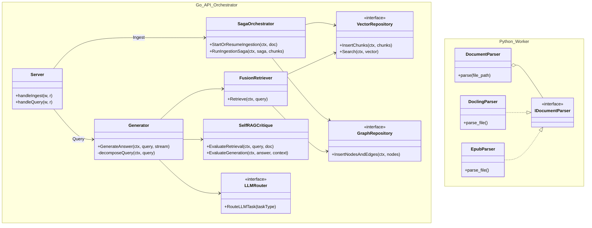

# Class Design: BookSage Architecture

This document visualizes the core architecture of BookSage, covering both the **Ingestion Pipeline** (Data Processing) and the **Query Engine** (RAG Generation).

## Component Overview

### Ingestion Pipeline
- **Go Saga Orchestrator**: Manages the distributed transaction of document ingestion.
- **Python Worker**: Specialized ETL engine using a Strategy pattern for file parsing.

### Query Engine
- **Generator**: Implements Agentic RAG logic (CoR, Self-RAG).
- **FusionRetriever**: Orchestrates hybrid search across Vector and Graph databases.
- **LLMRouter**: Routes tasks to appropriate LLM backends (Local vs Cloud).

## Class Diagram

