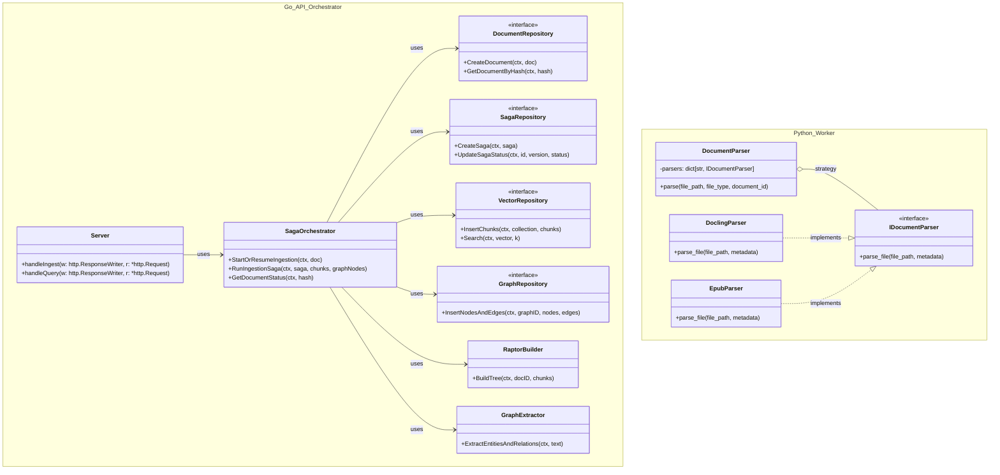

# Class Design: Document Ingestion Pipeline

This document visualizes the structural relationship between the Go API Orchestrator (Core Logic) and the Python Worker (ETL Engine) involved in the document ingestion process.

## Component Overview

- **Go API Orchestrator**: Manages the ingestion lifecycle using the Saga pattern. It orchestrates vector embedding, RAPTOR tree construction, and GraphRAG entity extraction.
- **Python Worker**: Acts as a specialized ETL engine. It uses a Strategy pattern to select the appropriate parser (e.g., Docling for PDF/Docx, standard libraries for Epub) based on file type.

## Class Diagram

