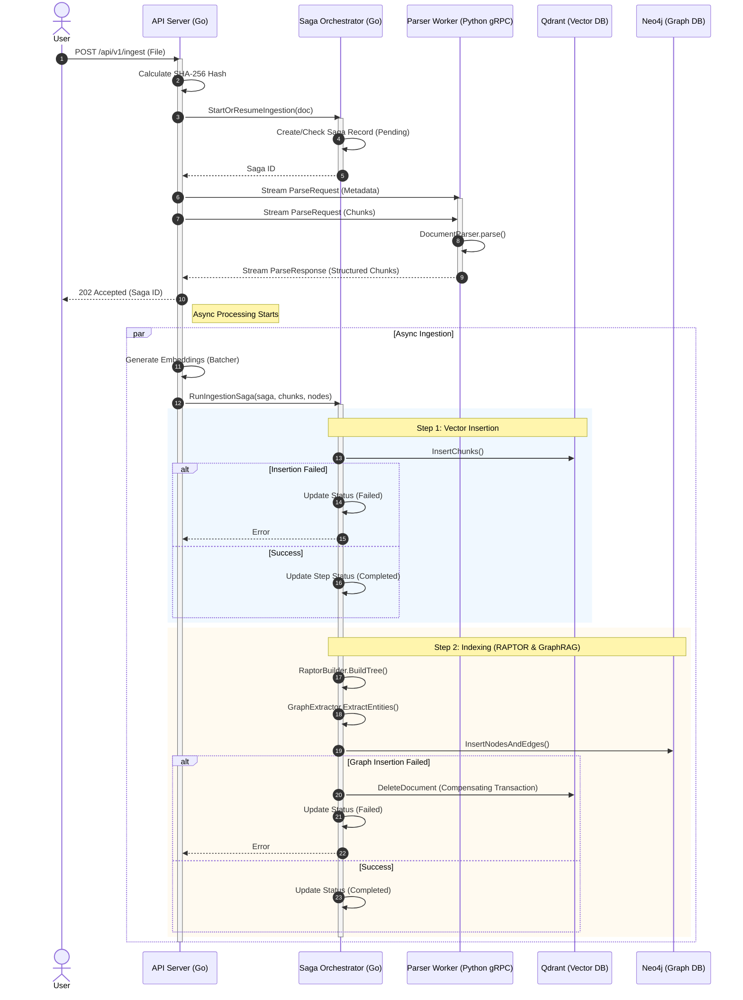

# Sequence Diagram: Document Ingestion Flow

This document visualizes the end-to-end flow of document ingestion in BookSage. It details the interaction between the user, the Go API Orchestrator, the Python Parser Worker, and the databases (Qdrant & Neo4j).

## Flow Overview

1.  **Upload & Validation**: The user uploads a document. The server calculates a hash and initializes a Saga record.
2.  **Streaming Parse**: The file is streamed to the Python Worker via gRPC for high-performance parsing (e.g., using Docling).
3.  **Async Processing**: The user receives an immediate `202 Accepted` response while the server processes the document in the background.
4.  **Saga Execution**: The `SagaOrchestrator` manages a multi-step transaction:
    -   **Vector Insertion**: Chunks are embedded and stored in Qdrant.
    -   **Graph Construction**: A RAPTOR tree is built, and entities are extracted for GraphRAG. These are stored in Neo4j.
    -   **Compensation**: If the Graph step fails, the Vector step is rolled back to ensure consistency.

## Sequence Diagram

