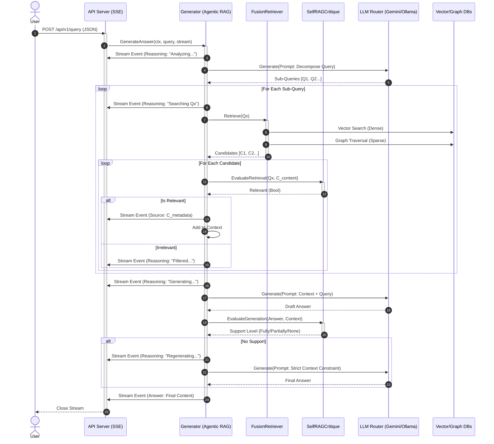

# Sequence Diagram: RAG Generation Flow

This document visualizes the advanced RAG (Retrieval-Augmented Generation) process, including Chain-of-Retrieval (CoR), Fusion Retrieval, and Self-RAG critique loops.

## Flow Overview

1.  **Decomposition (CoR)**: The query is analyzed and broken down into simpler sub-queries if complex.
2.  **Fusion Retrieval**: Each sub-query is executed against both Vector (Qdrant) and Graph (Neo4j) databases.
3.  **Retrieval Critique (Self-RAG)**: Retrieved chunks are evaluated for relevance. Irrelevant chunks are filtered out.
4.  **Generation**: The LLM generates an answer based on the filtered context.
5.  **Generation Critique (Self-RAG)**: The answer is checked for grounding/support. If unsupported, regeneration is triggered with strict constraints.
6.  **Streaming**: All steps (reasoning, sources, answers) are streamed to the client via Server-Sent Events (SSE).

## Sequence Diagram

